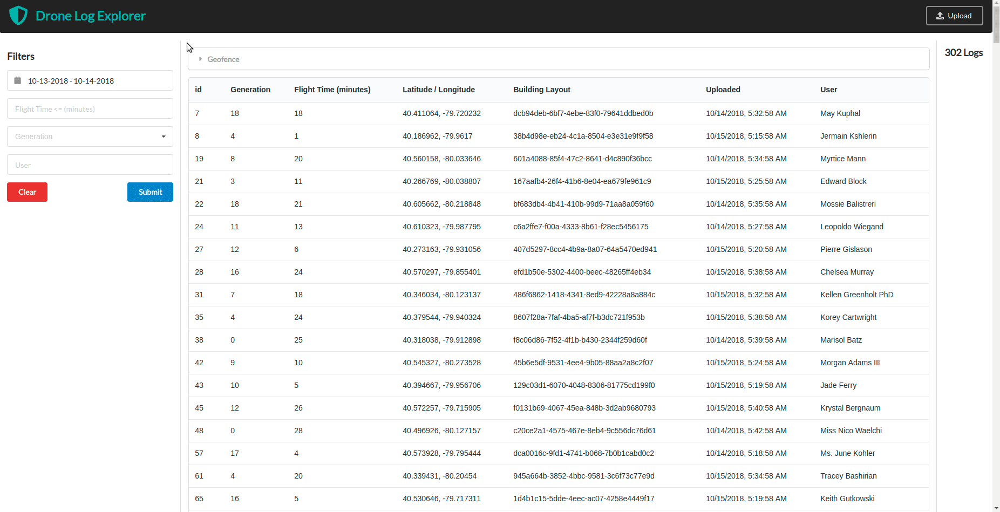

## Preface
This project contains my submission for the FullStack Engineer position at ShieldAI - Full-Stack/Back-End Assignment *./guidelines.pdf*.

Using `create-react-app` as a starting point, I implemented an end-to-end javascript pipeline for 
storing, consuming, interfacing, and retrieving logs.

The tool provides a datastore and visualization layer for Serial ID, start_time,
end_time and generation.
- the datastore surfaces the required endpoints, `api/getLogs` and `api/insertLogs` through an rpc-esque api 
- the frontend React/Redux app includes extra #2, the bounded rectangle, as a filter under the geofence accordion.



#### tl; dr
There's alot to unpack and y'all are busy so navigate to `quickstart`
```
tar –xzvf shield.tar.gz
```

## App

### ClientSide

- Base Create React App provides webpack boilerplate for zero config building https://github.com/facebook/create-react-app
- Redux as a single source of truth for shared frontend state
- Reused the developer friendly, Semantic-UI for plug-n-play styling https://react.semantic-ui.com/introduction

- A user can upload a csv via the upload button in top right corner and supplying a csv which matches the prompt 
- A user can set filters or clear them in the left pane -> then submit a request for new set of logs
- Geofence is an accordion hiding a google maps component which will render the logs. Use the bounding box to a apply a filter -> Click submit to query the database.
- Error messages from the api *should* appear on the left hand side of the screen.
- Clicking a row will show the raw log data in a right hand pane

Relevant modules from *./package.json*
```
    "react": "^16.4.1",
    "react-dom": "^16.4.1",
    "react-file-reader": "^1.1.4",
    "react-google-maps": "^9.4.5",
    "react-json-view": "^1.19.0",
    "react-redux": "^5.0.7",
    "react-scripts": "1.1.4",
    "redux": "^4.0.0",
    "redux-thunk": "^2.3.0",
    "semantic-ui-calendar-react": "^0.6.0",
    "semantic-ui-offline": "^2.3.2",
    "semantic-ui-react": "^0.81.3",
```
### API 

- Express server statically hosting the UI with a universal pass-through and gzipped compressed
- Successful data enveloped { data: ..., success: true} 200 response
- Erroneous responses include a stack trace or { data: null, error: stacktrace, success:false } 500 response
- Includes a pg module with connection pooling, multer middleware for identifying 
- http://localhost:5000/api/getlogs - GET request
- http://localhost:5000/api/insertlogs - POST request

Relevant modules from *./package.json*
```
    "compression": "^1.7.2",
    "express": "^4.16.3",
    "fast-csv": "^2.4.1",
    "multer": "^1.3.1",
    "pg": "^7.4.3",
    "pg-copy-streams": "^1.2.0",
```
### DB

- On AWS RDS, I stood up a Postgres 9.6.X persistant datastore
- Bulk insertions done with COPY as its batched and faster than INSERT 
- */home/jmunoz/practice/shield/api/database/migrations.sql* includes the responsible SQL

#### Schema
```
drones=> \d logs
                                          Table "public.logs"
       Column        |            Type             |                     Modifiers                     
---------------------+-----------------------------+---------------------------------------------------
 id                  | integer                     | not null default nextval('logs_id_seq'::regclass)
 drone_generation    | integer                     | not null
 start_time          | timestamp without time zone | not null
 end_time            | timestamp without time zone | not null
 lat                 | double precision            | not null
 lng                 | double precision            | not null
 building_map_layout | uuid                        | not null
 created_at          | timestamp without time zone | default now()
 username            | text                        | 
Indexes:
    "logs_pkey" PRIMARY KEY, btree (id)
    "lat_idx" btree (lat)
    "lng_idx" btree (lng)
    "username_idx" btree (lower(username))

```

## Quickstart 

### Docker
I recommend using docker to guarentee congruent build environments with the caveat that Docker has notable performance sacrifices on OSX.
```
docker build -t shield . && docker run shield --port 5000:5000
```

### Local
If you're familiar with node, npm, react, express, and the js end-to-end stack here's a 0-60 jumpstart

```
npm install && npm run build && npm run start
```

### Development mode with hotreloading
Quicker to hot reload and devtest, but without minification, tree-shaking, and other webpack perks.
```
npm run start
```

### Production mode with hotreloading
Slower to hot reload, but indicative performance of deployed app
```
npm run start-prod
```

## Testing and  Other Useful scripts

I included examples of functioning and nonfunctioning, due to invalid formatting, in the assets/ dir (assets/exampleWorkingCSV and _assets/exampleBrokenCSV_) 

`npm run mock` - Generates 1000 random entries using *faker*. Check out and modify generateMock.js to import your own entries.
`npm run db` - TTY postgres shell to the aws RDS database instance. Feel free to futz with it.
`node analyze.js` - Builds a production deploy and shows the bundle analysis
`nvm exec 9.4.0 node server.js` - Runs node with a specified version using node version manager

Relevant modules from *./package.json*
```
    "concurrently": "^3.6.0",
    "faker": "^4.1.0",
    "generate-random-points": "0.0.0",
    "nodemon": "^1.17.5",
    "webpack-bundle-analyzer": "^2.13.1"
```

## Source tree

```
package.json - npm configurations and, to-be-installed modules `npm install`
package-lock.json - autogenerated from npm install
README.MD - Starting point 
src - The React / Redux / Semantic UI lives here
├── actions
│   ├── logs.js - Redux actions for fetching / inserting logs and applying filters to requests
│   └── transient.js - Redux actions for UX 
├── components - Reusable React components built on Semantic UI / Somewhat overloaded term to also include react containers and stateless functions 
│   ├── App.css
│   ├── App.js - Top level App for attaching the singe source of truth (redux store)
│   ├── DroneBodyDir - Meat and Beans of the UI showing a set of filters on the left pane, a geofence and table in the middle, and LogCount on the right
│   │   ├── DroneAccordion.js - Hideable container for displaying GoogleMaps and allowing users to draw a geofence filter
│   │   ├── DroneBody.css
│   │   ├── DroneBody.js - A table displaying all logs returned from the server - defaulted to July 5. A virtualized table (infinite scroll, woohoo! ) or pagination (yuck!) is a necessary future step since generating 10000 rows with react/redux ~2 seconds to render
│   │   ├── DroneDatePicker.js - Modified https://www.npmjs.com/package/semantic-ui-calendar-react for selecting dates. Input altered to readonlymode prevent users from setting arbitrary dates.
│   │   ├── DroneFlightTime.js - Component for selecting maximum flight duration filter. Currently only for less than queries, but I'm envisioning an attached button dropdown with > and =.
│   │   ├── DroneGeneration.js - Dropdown filter hardcoded to 0-29 for filtering on drone generation.
│   │   └── DroneNetwork.js - Displays an error message and stack trace (if available) whenever the api returns with a 500 status code.
│   ├── DroneDeepDir
│   │   ├── DroneDeep.css
│   │   └── DroneDeep.js - Shows the raw input on the lower right side of the viewport when a log in the table's selected
│   ├── DroneHeaderDir
│   │   ├── DroneHeader.css
│   │   └── DroneHeader.js - Fancy title + a button to show a modal for uploading via csv.
│   ├── DroneUploadDir
│   │   ├── DroneUpload.css
│   │   └── DroneUpload.js - Upload via csv modal. Shows the general format
│   └── logo.svg
├── index.css
├── index.js
├── reducers
│   ├── logs.js
│   ├── rootReducer.js
│   └── transient.js
└── store.js
api
├── aws.json - aws creds for db and, in the future, an s3 bucket
├── database - database logic, connections, queries, mutations, and a mock generator 
│   ├── migrations.sql - SQL logic for generating the necessary tables. It's really only 1 migration and a few unnecessary indicies.
│   ├── mock - Generates fake / *randomized* logs and inserts into the database
│   │   ├── db.sql - a pg_dump of an early version of the table. Handy for reference purposes.
│   │   ├── generateMock.js - `node generateMock.js` to insert 1000 rows of random data
│   │   ├── latlongbug.js - Found a bug in a random point generator library so it be chucked.
│   │   └── mock.js - actual logic for building pseudorandom entries
│   ├── mutations.js
│   ├── postgres.js
│   └── queries.js
└── routes.js
assets
├── 58bff218-c200-400d-9078-3b3fda8923df.png - I suppose these map_building_layout files are moot until they're dumped to an s3 bucket
├── d17438d7-dddf-4762-8852-e8b11e8cf2d5.png
├── exampleBrokenCSV.csv - Example of a csv that breaks upload and returns an error message
└── exampleWorkingCSV.csv - Example of a functioning csv
upload - temporarily stores an uploaded csv while the db ingests the records
analyze.js - run `node anaylze.js` to see why my bundle's 300+ kb (Treeshaking on semantic and lodash) https://github.com/facebook/create-react-app/issues/3518
public - React create app cruft - displays an icon in the upper left tab, etc
├── favicon.ico
├── index.html
└── manifest.json
```

## Build Environment

* OS - Ubuntu 16.10
* npm - 5.5.1 - https://nodesource.com/blog/installing-node-js-tutorial-using-nvm-on-mac-os-x-and-ubuntu/
* node - v9.3.0 - https://nodesource.com/blog/installing-node-js-tutorial-using-nvm-on-mac-os-x-and-ubuntu/
* psql - (PostgreSQL) 9.6.9 - https://www.godaddy.com/garage/how-to-install-postgresql-on-ubuntu-14-04/
* docker - 1.13.1, build 092cba3 - https://www.digitalocean.com/community/tutorials/how-to-install-and-use-docker-on-ubuntu-16-04
* npx - 9.6.0
* create-react-app - 1.5.2 - https://github.com/facebook/create-react-app
* vscode (insiders) - 1.25.0-insider 6ca99aca80e80224f1c0bd4370c6ec4941c3bc54 x64 - https://code.visualstudio.com/insiders/

## Issues
Email me - jon.munoz.dev@gmail.com
